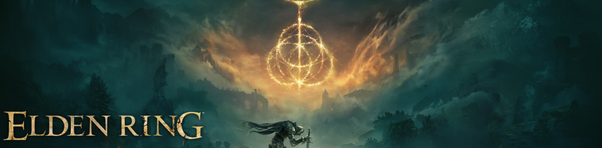
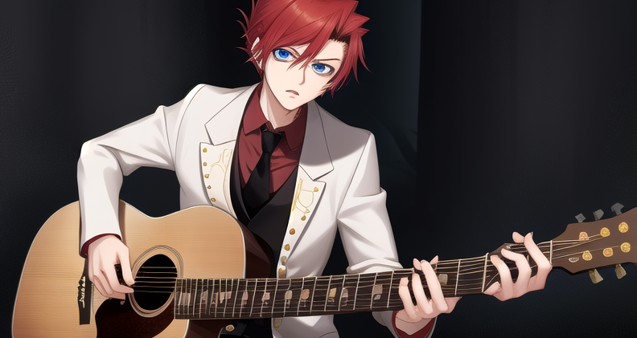

# cliplm
Ask LLaMa model about your image in your clipboard.

CLI tool to play around and test vision models that `llama.cpp` can run.
It sends requests to the `llama.cpp` server.

## Example
Using `llava-v1.6-mistral-7b`.


```text
$ cliplm
Assistant is skillful in writing long and detailed description to images.
USER: [img-1] Describe the image.
ASSISTANT: The image is a digital artwork featuring a mystical or fantasy setting. In the foreground, there's a large, glowing orb with what appears to be magical energy emanating from it. Above this orb, the text "ELDEN RING" is prominently displayed in an elegant, serif font that suggests a connection to the fictional world of the same name.

The background shows a dark, cloudy sky, which creates a dramatic and atmospheric effect. Below the orb, there's a silhouette of what seems to be a character standing on a platform or pedestal, suggesting an important or significant role within this context. The character is holding a staff or wand, further emphasizing the magical or mystical theme of the image.

The overall color palette consists mainly of dark tones with highlights that draw attention to the central orb and the silhouetted character, creating a sense of depth and focus in the artwork. The style of the image is reminiscent of fantasy illustrations found in books or video games, designed to evoke a sense of wonder and mystery.
```

You can enter interactive chat mode with `-i` CLI flag:


```
$ cliplm -i
Assistant is skillful in writing long and detailed description to images.
USER: [img-1] Describe the image.
ASSISTANT: The image features a young male character with red hair and blue eyes. He is wearing a white suit with a black tie and has a guitar in his hands. He seems to be playing the guitar, as suggested by his focused expression and the positioning of his hands on the neck of the instrument. The background is dark, possibly indicating an indoor setting or a stage, which contrasts with the brightly lit character. The overall style of the image suggests it may be from an anime or manga series.
USER: Say the probability that image was generated by AI
ASSISTANT:  Based on the image provided, it is likely that the character and the background were created by AI. The level of detail in both the character's features and the background suggest a high degree of sophistication in the artwork, which is often achieved through advanced digital art techniques. However, without additional context or information about the specific series or artist, I cannot provide an exact probability.
USER: Cannot say that it is highly detailed, but it looks like bad generation
ASSISTANT:  I apologize if the image you provided does not meet your expectations. However, it's important to note that AI-generated images can vary greatly in quality and detail depending on the specific algorithms and training data used. If the image appears to be of lower quality or lacks certain details, this could be due to a number of factors such as the complexity of the subject matter, the quality of the training data, or the specific AI model used.
```

## CLI
There are other CLI flags:
```
Usage: cliplm [OPTIONS]

Options:
      --host <HOST>                llama.cpp server host [default: 127.0.0.1]
      --port <PORT>                llama.cpp server port [default: 7001]
  -p, --prompt <PROMPT>            Initial prompt in format `<system> USER: <user> ASSISTANT: <empty or handwritten assistant response>` [default: "Assistant is skillful in writing long and detailed description to images.\nUSER: [img-1] Describe the image.\nASSISTANT:"]
      --prompt-file <PROMPT_FILE>  Has priority over `--prompt`. Read initial prompt from file
  -i, --interactive                Start in interactive chat mode
  -c, --copy-back                  Copy response to clipboard (not in interactive mode)
  -t, --temperature <TEMPERATURE>  Sampling temperature [default: 0.5]
  -n, --n-predict <N_PREDICT>      Token predict limit [default: 1024]
  -h, --help                       Print help
```